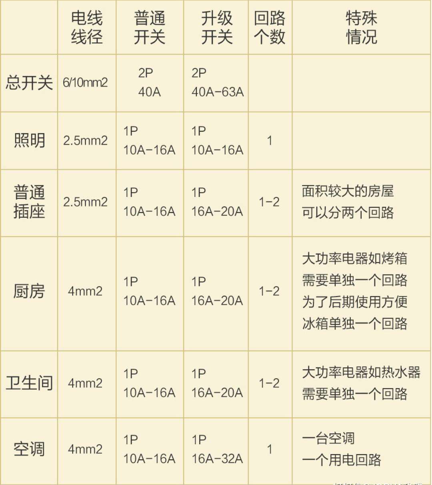
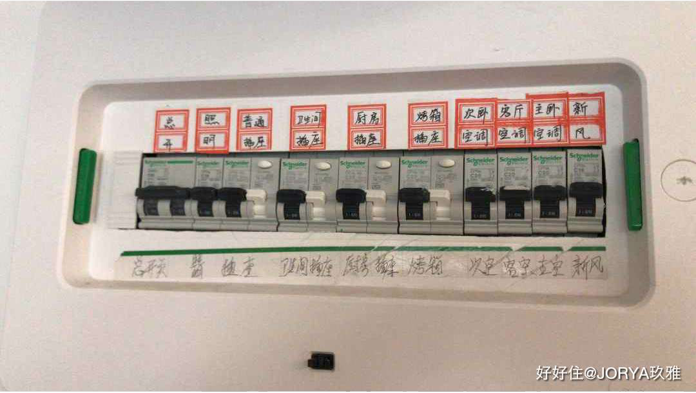

# 水电
> 水电是装修中最重要的环节。

## 基础知识
* 强电和弱电。强电是用作一种动力能源，弱电是用于信息传递。电器用的是强电，网线，电话线视频线路是弱电。
* 电线越粗，能承载的电流越大。常见规格: 2.5平米, 4平米, 6平米。
* 电线颜色。一般强电线是红色的，弱电线是蓝色的，入户总线是白色的。也有的弱电线是白色的。
* 穿线管是用来保护内部的电线，多用PVC穿线管。

## 电表箱设计建议

别人家的

## 开关插座的设计
* 开关插座下沿距地面 30cm 且安装在同一高度，2个开关插座间的间距不超过 5mm。
* 照明开关距地面 1400mm 左右，距门边 100mm - 200mm。 照明开关建议使用 带灯光示意(夜光)的。
* 更多，点击[这里](https://m.haohaozhu.cn/blank/0000gy505000bhb7.html?is_share_activity=1&?is_share_activity=1)。

## 注意事项
* 方便后期维护
  * 记录水电改造的情况。推荐： 出水电施工图，水电点位图。否则，水电改造完后拍照。
  * 水管走顶。好处是：漏水时能及时发现，漏水维修的成本也低。劣势是，材料费比走地贵。
  * 水管走顶，必须用管卡固定，两个管卡之间不能大于 80cm。 只要做是为了防止时间久后，水管变形。
  * 电线尽可能靠着四周铺设。 理由：
    * 可避免出现太多的交叉。
    * 不用担心后期安装地面或墙面的物品时，给电管造成破坏。
  * 在主配电闸箱中，给每一路电闸贴好标签。
  * 水路墙体开槽，如果墙体为实体墙，则开槽内壁需要涂防水材料，再铺设管道。
* 减少安全隐患
  * 强电箱要放在儿童触碰不到的高处。
  * 水电不可同管铺设。
  * 无论水路，电路，墙面都不可以横槽铺管。横槽会影响墙面水泥的承重，导致水泥的下坠或脱落。
  * 减少强弱电的电流干扰：
    * 强弱电线交汇处，要包裹锡箔纸。
    * 强弱电线不可同管铺设，且铺设间距租好大于 30厘米。
  * 同线管内，穿线不能超过3根。 为了方便以后抽出。
* 提升使用体验
  * 下水管包上隔音棉。 减少噪音。
  * 在厨房中留个屋内进水总阀，虽然水表箱内有总开，但考虑到水表箱在户外，一般都是锁上的，万一家里有关于漏水的现象就方便关闭总阀。
  * 打在墙里的弱电箱，来放猫，路由器。
  * 插座留出线头大于 15cm， 灯位线路留出线头大于 50cm。方便安装。

## 验收
* 水
  * 水路改造完成后修须进行打压实验，打压不低于8公斤压力，保持时间不低于30分钟。所有管道无渗水滴漏，打压30分钟后打压机没有明显棹压即矸。(这一点正规的公司都是有相应要求的，时间上也有可能会有上下变动)
* 电
  * 要测试零钱火线地线三根线是否接通，带漏电保护器的回路还要测试是漏电保护器否能正常使用。（用多功能电源电测仪？）

## 材料品牌
* 电线
  * 强电线品牌： 朝阳昆仑，慧远，海燕。
  * 弱电线品牌： 秋叶原，西门子。
* 穿线管品牌： 华翌，联塑，伟星。
* 插座。
* 水管。 管道抗压力最低不能低于5公斤，建议选择抗菌型管材。品牌：日丰，伟星，金德，联塑，天力。